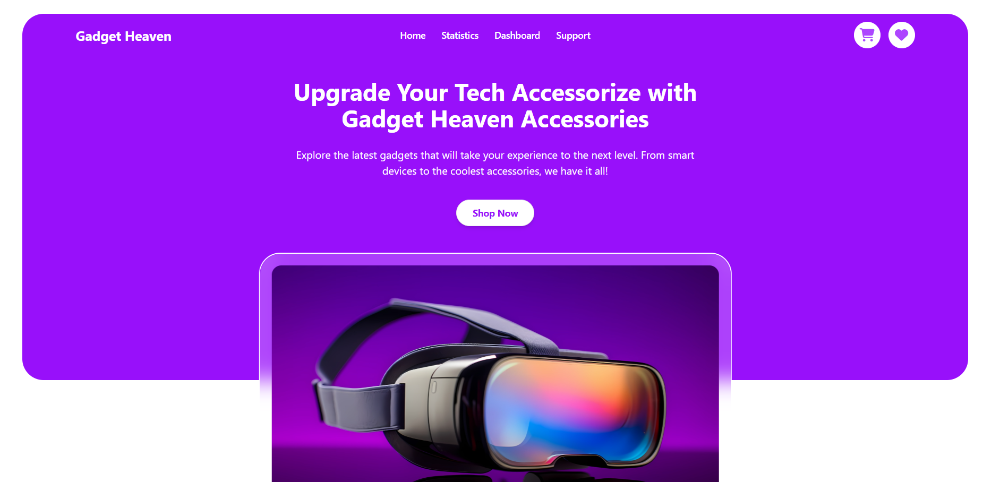

<h1 align="center">⚡ Gadget Heaven – Modern Gadget Store</h1>

  Your one-stop solution to explore, compare, and manage gadgets with ease.  
  A complete gadget shopping experience with cart, wishlist, statistics, and more.

  <!-- Frontend Badges -->
  
  
  
  
  
  
  
  

---

## 🧾 Overview

**Gadget Heaven** is a modern gadget e-commerce platform built with **React, TailwindCSS, DaisyUI, React Router, and Recharts**.  
It allows users to browse gadgets, filter by category, view product details, manage cart & wishlist, and even track gadget statistics.  
The app also uses **local storage** to persist cart & wishlist data across sessions.

---
## 📸 Preview

  

---

## ✨ Key Features

### 🛒 Shopping Features
- Category-wise product browsing with clean cards
- Detailed product page with price & information
- Add to **Cart** & **Wishlist** (saved in Local Storage)
- Remove items from Cart/Wishlist
- **Sort Cart items by Price**
- **Total Cost Calculation** with dynamic update
- Wishlist & Cart both accessible in **Dashboard**
- **Purchase Confirmation Modal** with success message

### 📊 Statistics
- Interactive **Statistics Page** with **Recharts**
- Beautiful **bar + area chart** showing product price distribution

### 🎨 UI & UX
- Responsive design with TailwindCSS + DaisyUI
- Gradient buttons & icons (React Icons)
- **Toast notifications** for interactions
- Smooth modal for purchase confirmation
- Clean **Dashboard** for Cart & Wishlist

---

## 🚀 Tech Stack

**Frontend**  
- React  
- React Router  
- TailwindCSS  
- DaisyUI  
- React Icons  
- React Hot Toast  
- Recharts  

**Other**  
- Local Storage for persistence  

---

## 📂 Pages

- **Home** → Banner + Categories + Gadgets  
- **Statistics** → Product statistics chart  
- **Dashboard** → Cart & Wishlist with total cost and sorting  
- **Product Details** → Detailed view of a single gadget  
- **Support** → FAQs + Contact Form  
- **Error Page** → 404 handling  
